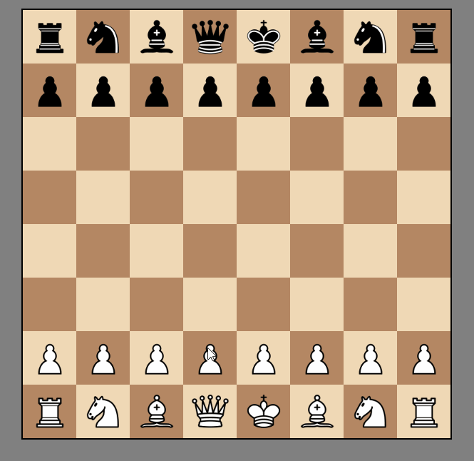
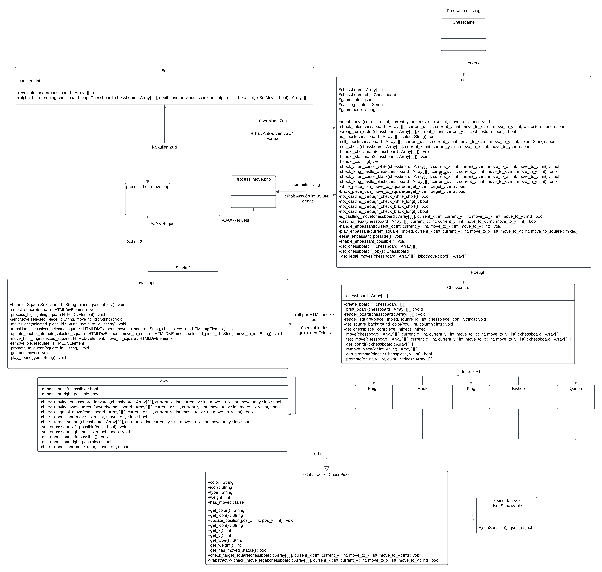

# ChessPHP

Welcome to ChessPHP, a beginner-friendly open-source project to learn more about web development.
Chess is universally understood, making it an ideal project to collaborate on.

### Preview

### Installing
1. Download XAMPP with PHP version 8.2 to get a local server and start Apache
2. Clone the Repo into the htdocs folder from XAMPP
3. Type http://localhost/ChessPHP/src/chessgame.php into your browser to open the project

### UML Class Diagramm

