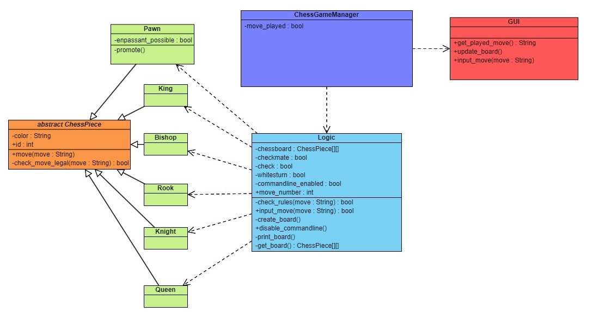

# ChessPHP

Welcome to ChessPHP, a beginner-friendly open-source project to learn more about web development.
Chess is universally understood, making it an ideal project to collaborate on.

## Project Structure
ChessPHP follows a structured approach to separate concerns and make collaboration among contributors easier. The project is divided into three main components:

### 1. Logic Class and Chess Rules
At the core of ChessPHP lies a logic class responsible for implementing the rules of chess. This class is complemented by a dedicated folder containing all the necessary chess rules. When you input a move using a string format like "kd4," the logic class validates whether the move is legal according to the rules of chess. Also logic is using a OOP approach having all the different pieces as seperate classes

### 2. User Interface (UI)
The next phase of development focuses on creating a user interface (UI) for the chess game. Using HTML and CSS, we'll render the chessboard, providing users with a visual representation of the game state. Additionally, JavaScript (JS) will enable users to input their moves directly on the UI for the interactive experience.

### 3. Controller
To maintain a clear separation of concerns and ensure a smooth flow of data between the UI and the logic class, ChessPHP includes a controller component. The controller acts as an intermediary, receiving user inputs from the UI and passing them to the logic class for validation. 

## UML notation

(Does not apply 100%)

### Installing

1. Download XAMPP with PHP version 8.2 to get a local server
2. Clone the Repo into the htdocs folder
3. Type http://localhost/ChessPHP/src/chessgame.php into your browser

### Version History

* 0.0
    * No release yet
